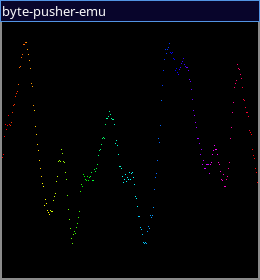
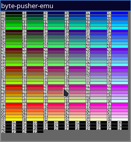
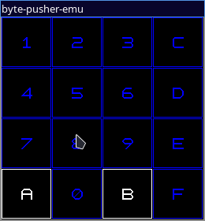

# BytePusher Emulator

This is a play at emulating a BytePusher machine developed by [Javamannen](https://esolangs.org/wiki/User:Javamannen).

Binary builds for linux x86_64 is available in GitHub Action runs.

This project uses SDL2 for i/o.



<details>
<summary>More screenshots</summary>

#### Palette Test


#### Keyboard test


</details>

Screenshot program author: [Javamannen](https://esolangs.org/wiki/User:Javamannen)

## Status

- [X] Memory
- [X] Color
- [X] CPU
- [X] Display adapter - SDL2 
- [X] Keyboard - SDL2
- [X] Audio - SDL2
- [X] Load a ROM

## Usage instructions

For help on how to use, please refer
```sh
./byte-pusher-emu --help
```

To load a program, use the following command.

```sh
./byte-pusher-emu -f rom.BytePusher
```

Loads a rom from the file specified. If `-f` is not mentioned, the VM will run with an empty memory (which will cause it to cycle endlessly).

## More information about the BytePusher VM

https://esolangs.org/wiki/BytePusher